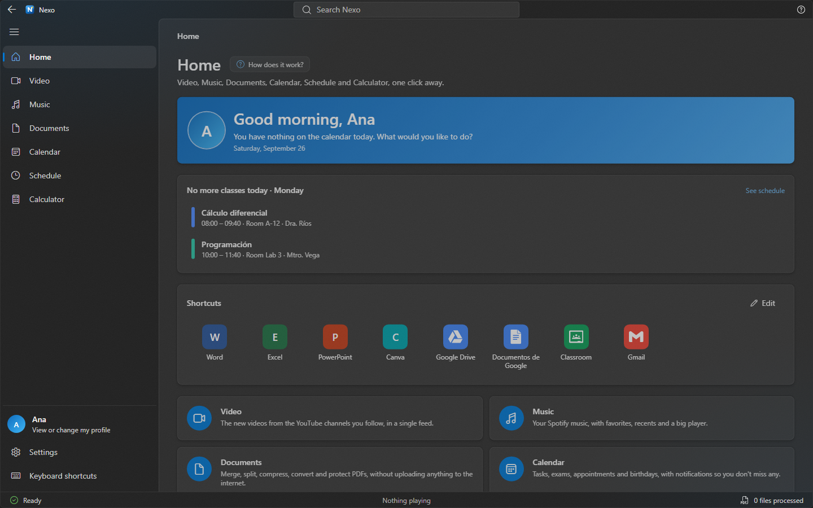

# Nexo

**Everything a student needs, in one window**: YouTube videos, Spotify music, PDF and Office tools, a calendar, a class schedule and a calculator, in the Windows 11 (Fluent) look. Everything is stored on your computer; your files never leave it.

🇪🇸 [Leer en español](README.md)

## What's in it

| | |
|---|---|
| **Video** | The newest videos from the YouTube channels you follow, in a single wall. No YouTube account needed. |
| **Music** | Your Spotify music (Premium is required to play inside Nexo): favorites, recents, playlists and a big player. Controllable from the system tray. |
| **Documents** | 17 tools that work offline: Word/Excel/PowerPoint to PDF, PDF to Word, merge, split, compress, rotate, organize, watermark, page numbers, protect and unlock, compare two PDFs, images to PDF and back, and OCR. If you have Microsoft Office, it uses it so the result comes out identical. |
| **My assignments** | One folder per subject (created from your schedule), with “New file” to make a blank Word, Excel, PowerPoint or text file right there. |
| **Global search** (`Ctrl + K`) | Finds sections, tools, events, classes, channels… and **text inside your PDFs**, opening them on the exact page. |
| **Calendar** | Tasks, exams, appointments and birthdays, with reminders. Exports to `.ics`. |
| **Schedule** | Your weekly classes. Scan the picture you were sent and it fills itself in. Warns you before each class. |
| **Calculator** | Standard and scientific, with history and keyboard support. |
| **Guides and what's new** | Each section explains itself the first time (and with “How does it work?” whenever you want). After an update, a dialog tells you what changed. |
| **Spanish and English** | Fully translated; change it in *Settings › Appearance › Language* (or follow Windows). |
| **Updates** | Nexo checks on its own when it opens and offers an “Update now” button. Your data is kept. |

> Screenshots use made-up sample data (the Spanish ones are in the [Spanish README](README.md)).

## Install

1. Download `Nexo_…_x64-setup.exe` from the [latest release](https://github.com/SebastianSKS/nexushub/releases/latest).
2. Run it. After that Nexo updates itself.

Designed for Windows 11.

## Privacy

Nexo has no accounts or server of its own. Your profile, calendar, schedule and settings live on your computer; Documents files are processed right there. The only things that go online are the YouTube and Spotify requests you make, and the update check on GitHub.
