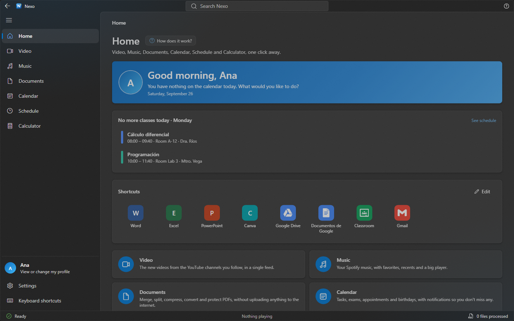

# Nexo

[](https://github.com/SebastianSKS/nexushub/actions/workflows/ci.yml)
[](https://github.com/SebastianSKS/nexushub/releases/latest)


**Everything a student needs, in one window**: YouTube videos, Spotify music, PDF and Office tools, a calendar, a class schedule and a calculator, in the Windows 11 (Fluent) look. Everything is stored on your computer; your files never leave it.

🇪🇸 [Leer en español](README.md)



## What's in it

| | |
|---|---|
| **Video** | The newest videos from the YouTube channels you follow, in a single wall. No YouTube account needed. |
| **Music** | Your Spotify music (Premium is required to play inside Nexo): favorites, recents, playlists and a big player. Controllable from the system tray. |
| **Documents** | 17 tools that work offline: Word/Excel/PowerPoint to PDF, PDF to Word, merge, split, compress, rotate, organize, watermark, page numbers, protect and unlock, compare two PDFs, images to PDF and back, and OCR. If you have Microsoft Office, it uses it so the result comes out identical. |
| **My assignments** | One folder per subject (created from your schedule), with “New file” to make a blank Word, Excel, PowerPoint or text file right there. |
| **Global search** (`Ctrl + K`) | Finds sections, tools, events, classes, channels… and **text inside your PDFs**, opening them on the exact page. |
| **Your day at a glance** | On Home, your next class with a countdown, what's due this week and what's pending in your notes. |
| **Calendar** | Tasks, exams, appointments and birthdays, with reminders. Exports to `.ics`. |
| **Schedule** | Your weekly classes. Scan the picture you were sent and it fills itself in, or import a classmate's with a code. Warns you before each class. |
| **Calculator and average** | Standard and scientific, with history and keyboard support. And an average tab: you write down your grades and Nexo tells you how you are doing and how much you need on what is left to pass. |
| **Notifications your way** | Nexo notifications (with its name and icon) before each class, a timed exam and a birthday; with five sounds of its own or Windows', and an hour-based “Do not disturb”. |
| **Make it yours** | Light or dark theme, any accent color, interface size, 12- or 24-hour times, a week that starts on Monday or Sunday, fewer animations and sections you can hide. |
| **Light on modest computers** | Low-power mode (automatic) removes transparency, lowers animations and makes the file search gentler. |
| **Backup** | Save all your data in a file and move it to another computer. It doesn't include your Spotify session. |
| **Guides and what's new** | Each section explains itself the first time (and with “How does it work?” whenever you want). After an update, a dialog tells you what changed. |
| **Spanish and English** | Fully translated; change it in *Settings › Appearance › Language* (or follow Windows). |
| **Updates** | Nexo checks on its own when it opens and offers an “Update now” button. Your data is kept. |

> Screenshots use made-up sample data (the Spanish ones are in the [Spanish README](README.md)).

## Install

1. Download `Nexo_…_x64-setup.exe` from the [latest release](https://github.com/SebastianSKS/nexushub/releases/latest).
2. Run it. If Windows shows “Windows protected your PC”, click *More info › Run anyway* (it's normal for new programs). After that Nexo updates itself.

**On Linux**, from the same release: the `.deb` (Ubuntu, Debian, Mint, Pop!_OS…) or the AppImage, which needs no installing:

```bash
sudo apt install ./Nexo_…_amd64.deb     # or: chmod +x Nexo_…_x86_64.AppImage and run it
```

Two things are not the same on Linux yet: music doesn't play inside Nexo (Spotify doesn't hand out its content protection to non-Chromium browsers, and the one the app uses on Linux isn't one), and document conversion uses LibreOffice instead of Microsoft Office. Everything else works the same, including the tray, the calendar, the schedule and PDFs.

Designed for Windows 11 and Linux. Questions or something not working? See the [help](HELP.md) or [report a problem](https://github.com/SebastianSKS/nexushub/issues/new/choose).

## Privacy

Nexo has no accounts or server of its own. Your profile, calendar, schedule and settings live on your computer; Documents files are processed right there. The only things that go online are the YouTube and Spotify requests you make, and the update check on GitHub.

## License

© 2026 Sebastián. All rights reserved — see [LICENSE.en](LICENSE.en). The code can be viewed and built for personal use, but not redistributed, ported to another system, or reused without permission. Nexo's name and logo are also reserved.
