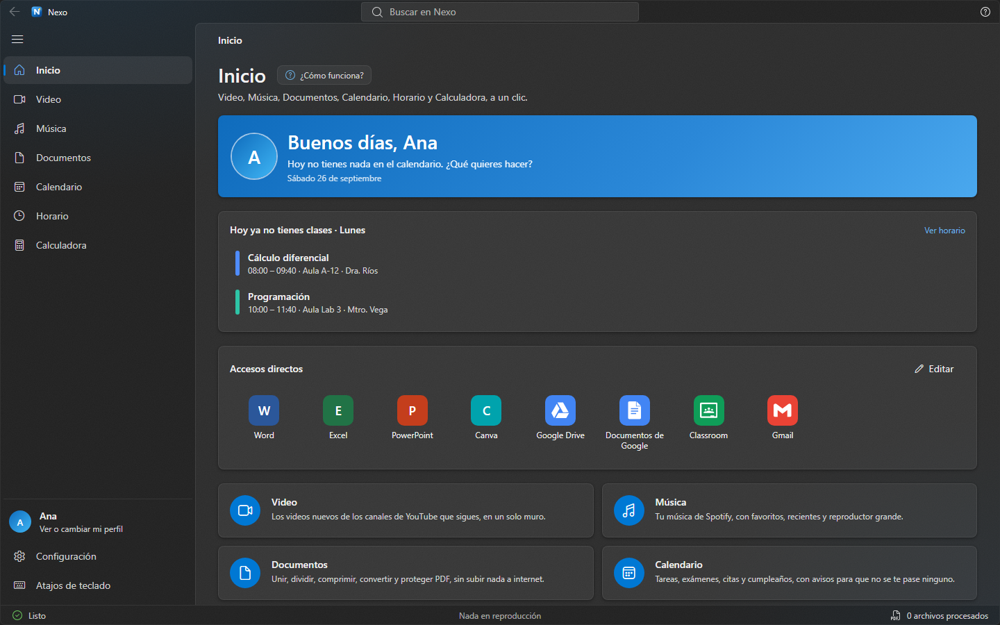
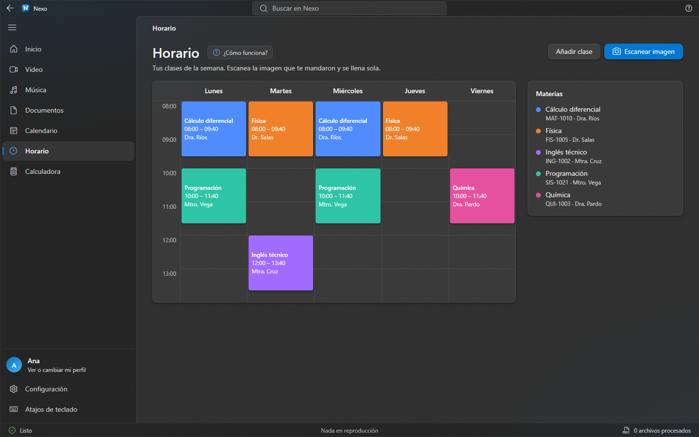
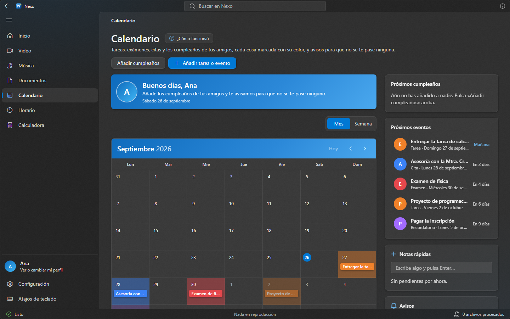
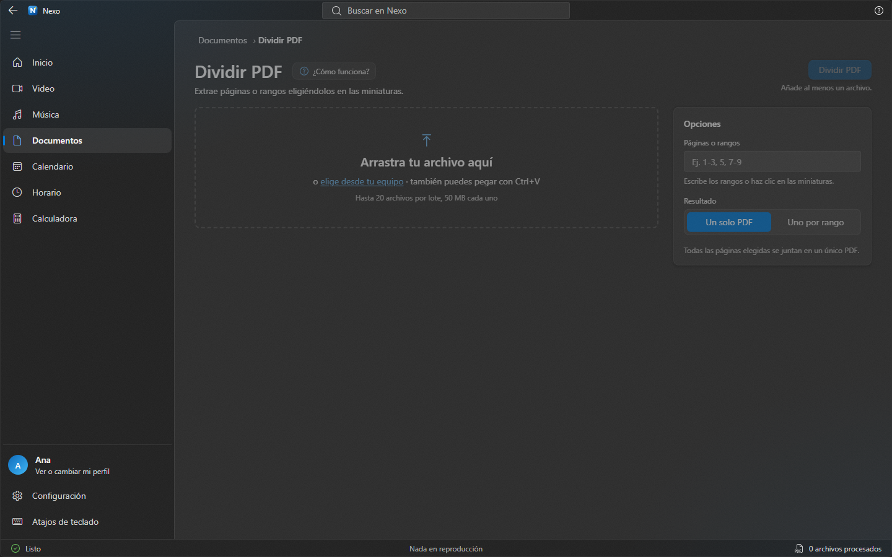
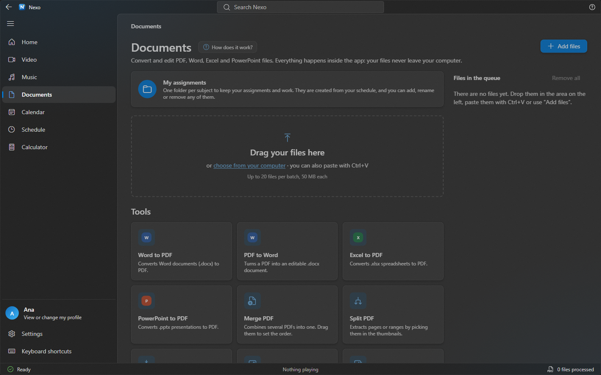

# Nexo

[](https://github.com/SebastianSKS/nexushub/actions/workflows/ci.yml)
[](https://github.com/SebastianSKS/nexushub/releases/latest)


**Lo que un estudiante necesita, en una sola ventana**: videos de YouTube, música de Spotify, herramientas de PDF y Office, calendario, horario de clases y calculadora, con el aspecto de Windows 11 (Fluent). Todo se guarda en tu equipo; tus archivos no salen de él.

🇬🇧 [Read this in English](README.en.md)



## Qué trae

| | |
|---|---|
| **Video** | Los videos nuevos de los canales de YouTube que sigues, en un solo muro. Sin necesidad de cuenta de YouTube. |
| **Música** | Tu música de Spotify (requiere Premium para reproducir dentro de Nexo): favoritos, recientes, listas y un reproductor grande. Con control desde la bandeja del sistema. |
| **Documentos** | 17 herramientas que funcionan sin internet: Word/Excel/PowerPoint a PDF, PDF a Word, unir, dividir, comprimir, rotar, organizar, marca de agua, numerar páginas, proteger y quitar contraseña, comparar dos PDF, imágenes a PDF y viceversa, y OCR. Si tienes Microsoft Office, lo usa para que el resultado salga idéntico. |
| **Mis tareas** | Una carpeta por materia (se crean desde tu horario), con «Nuevo archivo» para crear un Word, Excel, PowerPoint o texto en blanco ahí mismo. |
| **Buscador global** (`Ctrl + K`) | Encuentra secciones, herramientas, eventos, clases, canales… y **texto dentro de tus PDF**, abriéndolos en la página exacta. |
| **Calendario** | Tareas, exámenes, citas y cumpleaños, con avisos para que no se te pase nada. Exporta a `.ics`. |
| **Horario** | Tus clases de la semana. Escanea la imagen que te mandaron y se llena sola. Avisa antes de cada clase. |
| **Calculadora** | Estándar y científica, con historial y teclado. |
| **Guías y novedades** | Cada sección te explica cómo funciona la primera vez (y con «¿Cómo funciona?» cuando quieras). Tras actualizar, un cuadro te cuenta qué cambió. |
| **Español e inglés** | Todo traducido, se cambia en *Configuración › Apariencia › Idioma* (o sigue el de Windows). |
| **Actualizaciones** | Nexo revisa solo al abrir y te avisa con un botón «Actualizar ahora». Tus datos se conservan. |

<table>
  <tr>
    <td></td>
    <td></td>
  </tr>
  <tr>
    <td></td>
    <td></td>
  </tr>
</table>

> Las capturas usan datos de ejemplo inventados.

## Instalar

1. Descarga el instalador `Nexo_…_x64-setup.exe` de la [última versión](https://github.com/SebastianSKS/nexushub/releases/latest).
2. Ejecútalo. Después Nexo se actualiza solo.

Pensado para Windows 11.

## Desarrollo

Necesitas [Node.js](https://nodejs.org) 24 y, para la aplicación de escritorio, [Rust](https://rustup.rs) y las [dependencias de Tauri](https://tauri.app/start/prerequisites/).

```bash
npm install
npm run dev          # la web en http://localhost:3000
npm run tauri:dev    # la aplicación de escritorio
```

| Comando | Para qué |
|---|---|
| `npm run check` | Lo que corre en cada subida: tipos + idiomas + pruebas |
| `npm run typecheck` | Solo TypeScript |
| `npm test` | Pruebas unitarias (`tests/`, con el ejecutor de pruebas de Node) |
| `npm run i18n:check` | Que todo texto tenga su traducción al inglés y las variables coincidan |
| `npm run i18n:pendientes` | Busca textos en español que aún no pasan por la traducción |
| `npm run build` | Exportación estática (`out/`) |
| `npm run tauri:build` | Instalador de Windows |

### Cómo está hecho

- **Next.js 16** (exportación estática) + **React 19** + **TypeScript**, con Tailwind, Zustand y Framer Motion.
- **Tauri 2** para la ventana de escritorio y todo lo que toca el sistema (carpetas, Office, iconos de programas, bandeja, actualizaciones), en `src-tauri/`.
- `src/modules/*` son las secciones; `src/services/*`, la lógica sin pantalla; `src/lib/*`, funciones puras; `src/store/*`, el estado.
- Los PDF se leen con pdf.js y se crean con pdf-lib; el OCR es Tesseract, todo en tu equipo.

### Idiomas

El texto en **español es la clave**: se escribe `t("Guardar")` (o `T("…")` para textos que viven en datos) y el inglés está en `src/lib/i18n/en/*.json`, un archivo por sección. Para añadir un texto nuevo:

1. Escríbelo en español dentro de `t(...)`.
2. Ejecuta `npm run i18n:check`: te dice qué traducciones faltan. Añádelas al JSON de la sección.

La comprobación también corre en GitHub, así que no se puede subir un texto sin traducir.

### Revisión automática

Cada `push` y cada solicitud de cambios pasa por [`.github/workflows/ci.yml`](.github/workflows/ci.yml): tipos, idiomas, pruebas, compilación de la web y `cargo check` de la parte de escritorio. Si algo se rompe, GitHub lo marca con una ✗.

### Publicar una versión

Los pasos están en [ACTUALIZACIONES.md](ACTUALIZACIONES.md) (subir el número de versión, compilar firmando, generar `latest.json` y publicar el Release). La llave privada de firma **nunca** se sube.

## Privacidad

Nexo no tiene cuentas ni servidor propio. Tu perfil, calendario, horario y ajustes viven en tu equipo; los archivos de Documentos se procesan aquí mismo. Lo único que sale a internet son las llamadas a YouTube y Spotify que pides tú, y la búsqueda de actualizaciones en GitHub.
