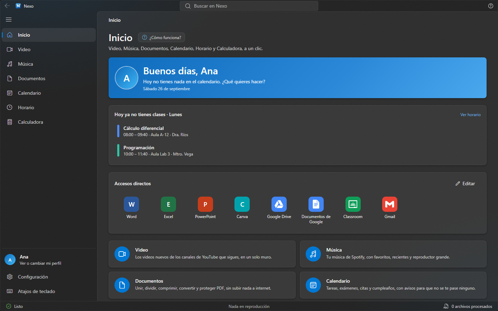
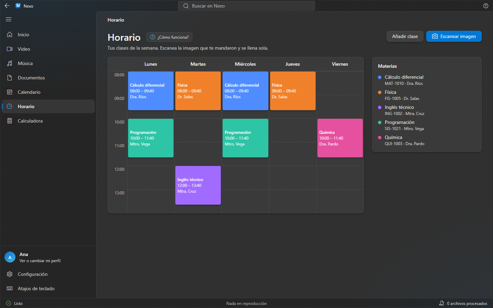
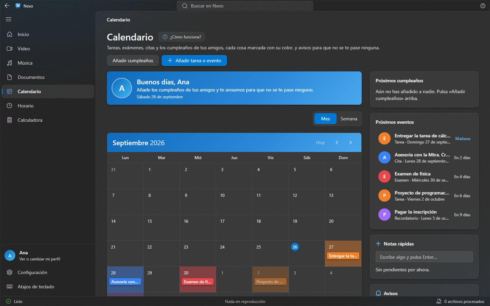
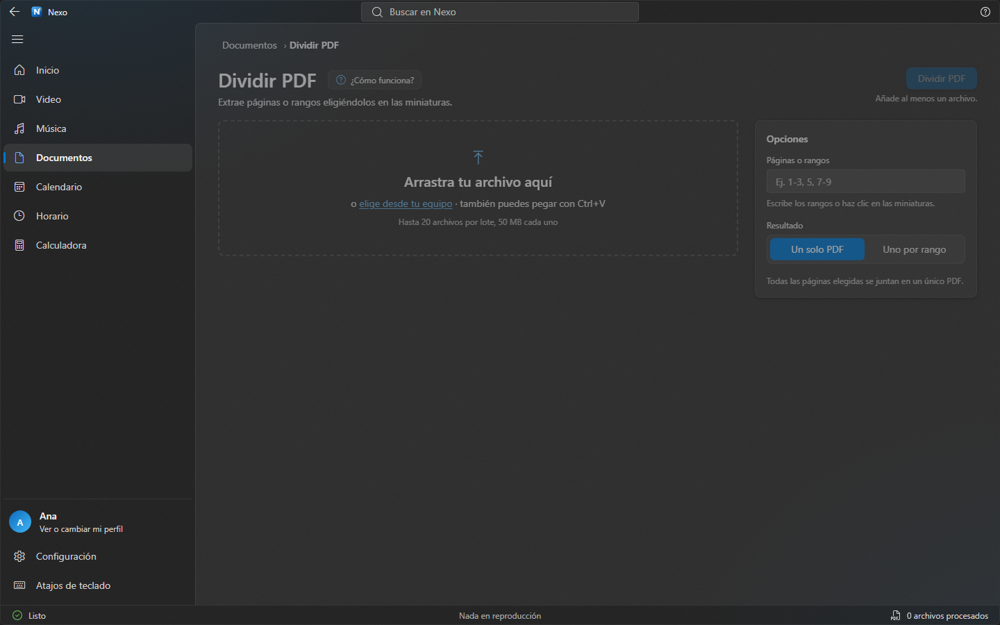
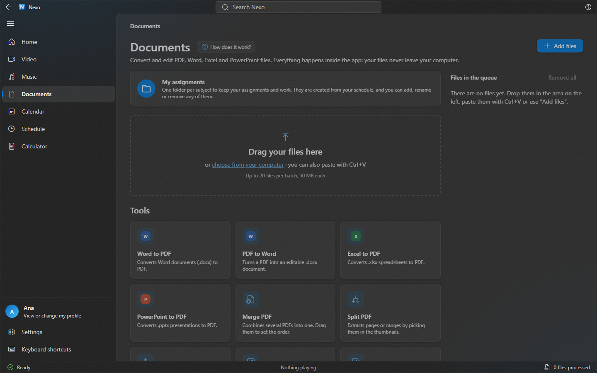

# Nexo

**Lo que un estudiante necesita, en una sola ventana**: videos de YouTube, música de Spotify, herramientas de PDF y Office, calendario, horario de clases y calculadora, con el aspecto de Windows 11 (Fluent). Todo se guarda en tu equipo; tus archivos no salen de él.

🇬🇧 [Read this in English](README.en.md)

## Qué trae

| | |
|---|---|
| **Video** | Los videos nuevos de los canales de YouTube que sigues, en un solo muro. Sin necesidad de cuenta de YouTube. |
| **Música** | Tu música de Spotify (requiere Premium para reproducir dentro de Nexo): favoritos, recientes, listas y un reproductor grande. Con control desde la bandeja del sistema. |
| **Documentos** | 17 herramientas que funcionan sin internet: Word/Excel/PowerPoint a PDF, PDF a Word, unir, dividir, comprimir, rotar, organizar, marca de agua, numerar páginas, proteger y quitar contraseña, comparar dos PDF, imágenes a PDF y viceversa, y OCR. Si tienes Microsoft Office, lo usa para que el resultado salga idéntico. |
| **Mis tareas** | Una carpeta por materia (se crean desde tu horario), con «Nuevo archivo» para crear un Word, Excel, PowerPoint o texto en blanco ahí mismo. |
| **Buscador global** (`Ctrl + K`) | Encuentra secciones, herramientas, eventos, clases, canales… y **texto dentro de tus PDF**, abriéndolos en la página exacta. |
| **Tu día de un vistazo** | En Inicio, la clase que sigue con cuenta regresiva, lo que entregas esta semana y lo pendiente de tus notas. |
| **Calendario** | Tareas, exámenes, citas y cumpleaños, con avisos para que no se te pase nada. Exporta a `.ics`. |
| **Horario** | Tus clases de la semana. Escanea la imagen que te mandaron y se llena sola, o importa el de un compañero con un código. Avisa antes de cada clase. |
| **Calculadora y promedio** | Estándar y científica, con historial y teclado. Y una pestaña de promedio: apuntas tus calificaciones y Nexo te dice cómo vas y cuánto necesitas en lo que falta para aprobar. |
| **Avisos a tu manera** | Notificaciones de Nexo (con su nombre e icono) antes de cada clase, de un examen con hora y de un cumpleaños; con cinco sonidos propios o los de Windows, y un «No molestar» por horas. |
| **Hazlo tuyo** | Tema claro u oscuro, cualquier color de acento, tamaño de la interfaz, horas de 12 o 24 horas, semana que empieza en lunes o domingo, menos animaciones y secciones que puedes esconder. |
| **Ligero en equipos modestos** | El modo de bajo consumo (automático) quita la transparencia, baja las animaciones y hace la búsqueda en archivos más pausada. |
| **Copia de seguridad** | Guarda todos tus datos en un archivo y pásalos a otra computadora. No incluye tu sesión de Spotify. |
| **Guías y novedades** | Cada sección te explica cómo funciona la primera vez (y con «¿Cómo funciona?» cuando quieras). Tras actualizar, un cuadro te cuenta qué cambió. |
| **Español e inglés** | Todo traducido, se cambia en *Configuración › Apariencia › Idioma* (o sigue el de Windows). |
| **Actualizaciones** | Nexo revisa solo al abrir y te avisa con un botón «Actualizar ahora». Tus datos se conservan. |

<table>
  <tr>
    <td></td>
    <td></td>
  </tr>
  <tr>
    <td></td>
    <td></td>
  </tr>
</table>

> Las capturas usan datos de ejemplo inventados.

## Instalar

1. Descarga el instalador `Nexo_…_x64-setup.exe` de la [última versión](https://github.com/SebastianSKS/nexushub/releases/latest).
2. Ejecútalo. Si Windows muestra «Windows protegió su PC», pulsa *Más información › Ejecutar de todas formas* (es normal en programas nuevos). Después Nexo se actualiza solo.

Pensado para Windows 11. ¿Dudas o algo no funciona? Mira la [ayuda](AYUDA.md) o [avisa de un problema](https://github.com/SebastianSKS/nexushub/issues/new/choose).

## Privacidad

Nexo no tiene cuentas ni servidor propio. Tu perfil, calendario, horario y ajustes viven en tu equipo; los archivos de Documentos se procesan aquí mismo. Lo único que sale a internet son las llamadas a YouTube y Spotify que pides tú, y la búsqueda de actualizaciones en GitHub.
